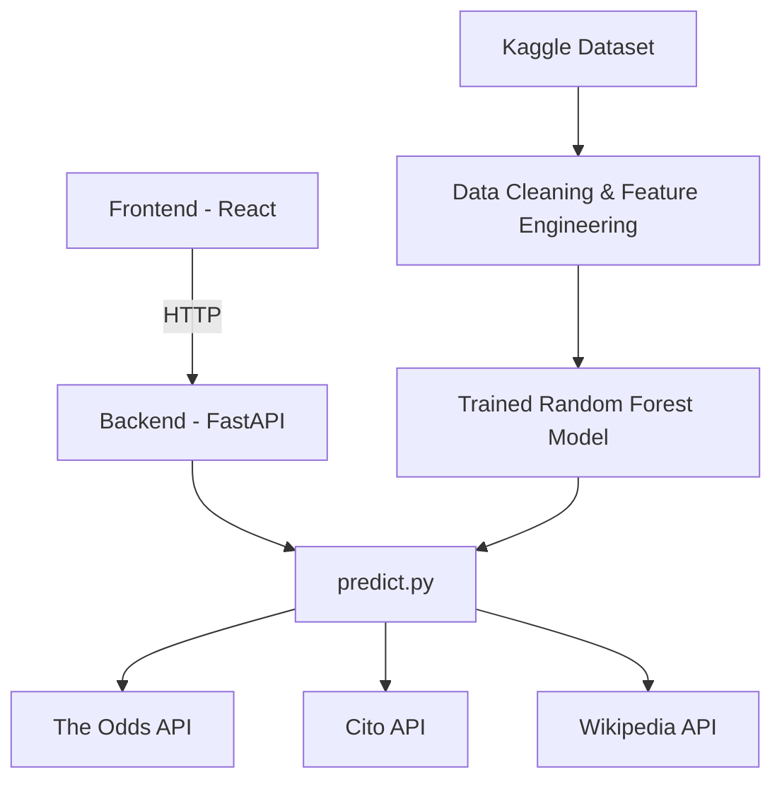

# UFC Fight Predictor

This project represents a full-stack machine learning web application that predicts the outcome of **real, upcoming UFC fights** using a model trained on historical UFC fight data, live odds, and current UFC roster information on the fighters the match is predicted for.

---

## Overview

Instead of having predictions be made on random hypothetical matchups, users select from a list of **upcoming confirmed scheduled UFC bouts**. Below describes the underlying process:

1. The backend pulls all upcoming MMA fights via their live odds pulled from the Odds API, then filters upon them to find UFC-specific matchups only based on whether both fighters are on the current active UFC roster, via Cito API.
2. The users picks one of these real fights, fills in a few details pertaining to the fight (weight class, whether it's a title fight, and number of rounds), and then requests a prediction.
3. The backend assembles a feature row from each fighter's historical data in the UFC in addition with the live betting odds for this fight, and feeds it into a trained Random Forest model, and returns the predicted winner with a confidence score attached.
4. If one of the fighters is new to the UFC and doesn't have any previous fight data from the training data, then the app falls back to a prediction based purely on the betting odds and the prediction result screen will clearly inform the user if done so.

---

## Architecture



- **ML pipeline** (`ml_core/`) — data cleaning, feature engineering, model comparison, and final model export, all in Jupyter notebooks.
- **Backend** (`backend/`) — a FastAPI service that loads the trained model and exposes two endpoints: one to list currently predictable fights, and one to generate a prediction for a specific matchup.
- **Frontend** (`frontend/`) — a React (Vite) single-page app that walks the user through picking a fight, filling in fight details, and viewing the result.
---
 
## Tech Stack
 
| Layer | Tools |
|---|---|
| Data Processing | Python, Pandas, NumPy |
| ML Model | Scikit-learn (Random Forest, compared against Logistic Regression, XGBoost, and SVM) |
| Backend | FastAPI, Uvicorn |
| Frontend | React (Vite) |
| External Data | The Odds API (live betting odds), Cito API (active UFC roster), Wikipedia API (fighter photos) |
| Version Control | Git + GitHub |
 
---

## Key Features

- **Real fight selection only** - no hypothetical matchups; every fight listed has live bettings odds for 2 UFC fighters who have an upcoming confirmed scheduled bout.
- **Confirmed vs rumoured tagging** - fights scheduled within 45 days are tagged as confirmed matches instead of rumoured matches that bookmakers create odds for. Fights further out than this can still be predicted from, but are tagged as rumoured matches instead of upcoming confirmed official scheduled ones.
- **Favorite/underdog corner assignment** — since the model was trained with a real historical correlation between corner assignment and betting favorite, each new matchup assigns the betting favorite to the "Red" corner and the underdog to "Blue," matching the pattern the model learned from.
- **Odds-only fallback** — if a selected fighter has no fight history in the training dataset (e.g. a UFC newcomer), the app falls back to a prediction based on live betting odds alone, and clearly informs the user the prediction was made based on the odds only instead of the prediction model.
- **Fighter photo lookup** — fighter photos are pulled from Wikipedia (if their page has a photo of them), with a clean initials-based placeholder as a fallback.

---
 
## Known Limitations
 
- **"Confirmed" vs. "rumored" is a heuristic, not a guarantee.** It's based on how far out a fight is scheduled, not official UFC confirmation, since no free API exposes that directly.
- **The odds-only fallback is a simpler model.** It reflects the betting market's opinion, not the trained Random Forest's — this is disclosed on-screen whenever it's used.
- **The active-roster cache is in-memory** and resets whenever the backend restarts, at which point it takes a bit longer to reload (it re-fetches the full UFC fighter directory in the background).
- **Wikipedia photo lookups can occasionally fail under heavy concurrent load** (rate limiting), in which case the app falls back to initials rather than showing an error.

---

## Setup / Running Locally
 
### Prerequisites
- Python 3.12.x
- Node.js (LTS)
- Free API keys from [The Odds API](https://the-odds-api.com) and [Cito API](https://citoapi.com)
### Backend
```bash
# from the project root
python -m venv ufc_venv
ufc_venv\Scripts\Activate.ps1        # Windows PowerShell
pip install -r requirements.txt
 
# create a .env file in the project root with:
# ODDS_API_KEY=your_key_here
# CITO_API_KEY=your_key_here
 
uvicorn backend.app.main:app --reload
```
Backend runs at `http://localhost:8000`. Interactive API docs available at `http://localhost:8000/docs`.
 
### Frontend
```bash
cd frontend
npm install
npm run dev
```
Frontend runs at `http://localhost:5173`.
 
### Model
The trained model, scaler-free (Random Forest doesn't require feature scaling), and its expected feature column order are saved in `ml_core/models/` after running the notebooks in `ml_core/notebooks/` in order (`01` → `02` → `03`).
 
---

## Data Source

The historical training data comes from the [Ultimate UFC Dataset](https://www.kaggle.com/datasets/mdabbert/ultimate-ufc-dataset) on Kaggle (`ufc-master.csv`), which compiles UFC fight and fighter statistics. All data cleaning, feature engineering, and model training performed on top of this raw dataset is original to this project.

---
 
## Project Structure
 
```
ufc-fight-predictor/
├── data/
│   ├── raw/                  # Original Kaggle dataset
│   └── processed/            # Cleaned, feature-engineered training data
├── ml_core/
│   ├── notebooks/            # EDA, model comparison, final model export
│   └── models/               # Saved model + feature column order (gitignored)
├── backend/
│   └── app/
│       ├── predict.py        # Core prediction logic (odds, roster, feature building, model)
│       ├── main.py           # FastAPI entry point
│       └── routes/
│           └── predict_route.py
├── frontend/
│   └── src/
│       ├── components/       # FightList, FightCard, FightDetailsForm, PredictionResult
│       ├── api/              # predictApi.js — all backend/external API calls
│       └── App.jsx           # Top-level flow: list → form → result
└── .env                      # API keys (gitignored)
```
 
---
 
## Future Improvements
 
- Per-prediction feature attribution (e.g. via SHAP) to show which stat differences most influenced a specific prediction, rather than only global model feature importance.
- A persistent (file- or database-backed) cache for the active UFC roster, rather than an in-memory cache that resets on restart.
